# RKGCN — Ripple Knowledge Graph Convolutional Networks

Implementation of the **RKGCN** model for recommendation systems, based on the paper:

> **"Ripple Knowledge Graph Convolutional Networks for Recommendation Systems"**
> Chen Li et al., *Machine Intelligence Research*, 2024

RKGCN combines two complementary approaches for knowledge-graph-enhanced recommendations:
1. **User Preference Aggregation** (inspired by RippleNet) — propagates user preferences through multi-hop KG links
2. **Entity Enhancement via GCN** (inspired by KGCN) — enriches item embeddings using graph convolution over KG neighborhoods

---

## Project Structure

```
IT414 Project/
├── README.md                  # This file
│
├── src/                       # All source code
│   ├── __init__.py
│   ├── main.py                # CLI runner — preprocessing, training, evaluation
│   ├── eda.py                 # Exploratory Data Analysis for both datasets
│   ├── requirements.txt       # Python dependencies
│   ├── preprocess.py          # Data preprocessing + KG construction from metadata
│   ├── data_loader.py         # Data loading, train/val/test split, ripple & neighbor sets
│   ├── model.py               # RKGCN model (TensorFlow/Keras)
│   ├── train.py               # Training loop with validation tracking
│   └── evaluate.py            # AUC and Accuracy evaluation
│
├── datasets/                  # Raw datasets
│   ├── MovieLens-1M/          # ratings.dat, movies.dat, users.dat
│   └── Book-Crossing/         # Ratings.csv, Books.csv, Users.csv
│
├── eda_outputs/               # Generated EDA plots (after running eda.py)
│   ├── MovieLens-1M/
│   └── Book-Crossing/
│
└── DWMenv/                    # Python virtual environment
```

---

## Requirements

| Package | Version | Purpose |
|---|---|---|
| TensorFlow | ≥ 2.10 | Deep learning framework |
| NumPy | ≥ 1.21 | Numerical operations |
| Pandas | ≥ 1.3 | Data loading & manipulation |
| Scikit-learn | ≥ 1.0 | Evaluation metrics (AUC, Accuracy) |
| Matplotlib | ≥ 3.5 | EDA plots & visualizations |

All listed in `src/requirements.txt`.

---

## Virtual Environment

The project uses a Python virtual environment named **`DWMenv`**.

### Setup
```bash
# Create the venv (already done)
python3 -m venv DWMenv

# Activate it
source DWMenv/bin/activate

# Install dependencies
pip install -r src/requirements.txt
```

### Activating (every session)
```bash
source DWMenv/bin/activate
```

---

## Datasets

### MovieLens-1M
- **Source**: [GroupLens](https://grouplens.org/datasets/movielens/1m/)
- **Size**: 1,000,209 ratings from 6,040 users on 3,706 movies
- **Rating scale**: 1–5 stars
- **RKGCN threshold**: rating ≥ 4 → positive interaction
- **KG**: Built from movie genres (18 genres) and release years

### Book-Crossing
- **Source**: [Book-Crossing Dataset](http://www2.informatik.uni-freiburg.de/~cziegler/BX/)
- **Size**: 1,149,780 ratings from 105,283 users on 340,556 books
- **Rating scale**: 0–10 (0 = implicit interaction)
- **RKGCN threshold**: rating > 0 → positive interaction
- **KG**: Built from book metadata (author, publisher, year)

---

## Usage

### Step 1: Activate the virtual environment
```bash
source DWMenv/bin/activate
```

### Step 2: Run EDA (optional — generates statistics and plots)
```bash
python -m src.eda --dataset both
```

### Step 3: Preprocess data
```bash
python -m src.main --dataset movie --preprocess
python -m src.main --dataset book --preprocess
```

### Step 4: Train and evaluate
```bash
# MovieLens-1M (paper defaults)
python -m src.main --dataset movie --dim 8 --n_hop 2 --n_memory 32 --lr 0.02 --n_epoch 10

# Book-Crossing (paper defaults)
python -m src.main --dataset book --dim 4 --n_hop 1 --n_memory 16 --lr 0.01 --n_epoch 10

# Multi-run averaging
python -m src.main --dataset movie --n_runs 5
```

### Hyperparameters (CLI arguments)

| Argument | Default | Description |
|---|---|---|
| `--dataset` | *required* | `movie` or `book` |
| `--dim` | 8 | Embedding dimension |
| `--n_hop` | 2 | Number of preference propagation hops |
| `--n_memory` | 32 | Preference set size per hop |
| `--n_neighbor` | 16 | Neighbor set size for GCN |
| `--kge_weight` | 0.01 | KG embedding loss weight |
| `--l2` | 1e-7 | L2 regularization weight |
| `--lr` | 0.02 | Learning rate |
| `--batch_size` | 1024 | Training batch size |
| `--n_epoch` | 10 | Number of training epochs |
| `--gcn_iter` | 1 | GCN aggregation iterations |
| `--n_runs` | 1 | Number of runs to average |

---

## Exploratory Data Analysis

### MovieLens-1M

#### Basic Statistics

| Metric | Value |
|---|---|
| Total ratings | 1,000,209 |
| Unique users | 6,040 |
| Unique movies | 3,706 |
| Total movies in DB | 3,883 |
| Density | 4.47% |
| **Sparsity** | **95.53%** |
| Avg ratings/user | 165.6 |
| Avg ratings/movie | 269.9 |
| Mean rating | 3.58 |
| Median rating | 4.0 |

#### Rating Distribution

| Rating | Count | Percentage |
|---|---|---|
| ⭐ 1 | 56,174 | 5.6% |
| ⭐ 2 | 107,557 | 10.8% |
| ⭐ 3 | 261,197 | 26.1% |
| ⭐ 4 | 348,971 | 34.9% |
| ⭐ 5 | 226,310 | 22.6% |

The distribution is **left-skewed** — users tend to rate higher. The 4-star rating is the most common.

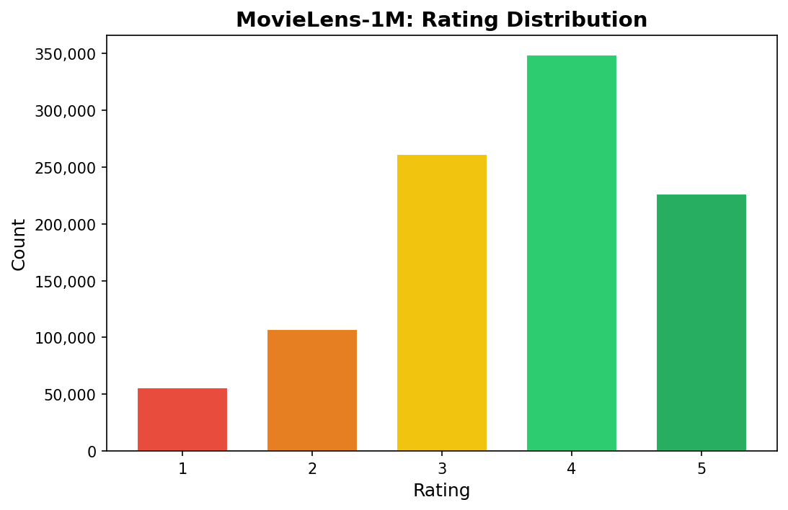

#### Ratings per User

| Metric | Value |
|---|---|
| Min | 20 |
| Max | 2,314 |
| Mean | 165.6 |
| Median | 96.0 |
| Std Dev | 192.7 |

A **minimum of 20 ratings per user** indicates this is a well-filtered dataset. However, the high std dev (192.7) shows a **long-tail distribution** — most users rate a moderate number of movies while some power users rate thousands.

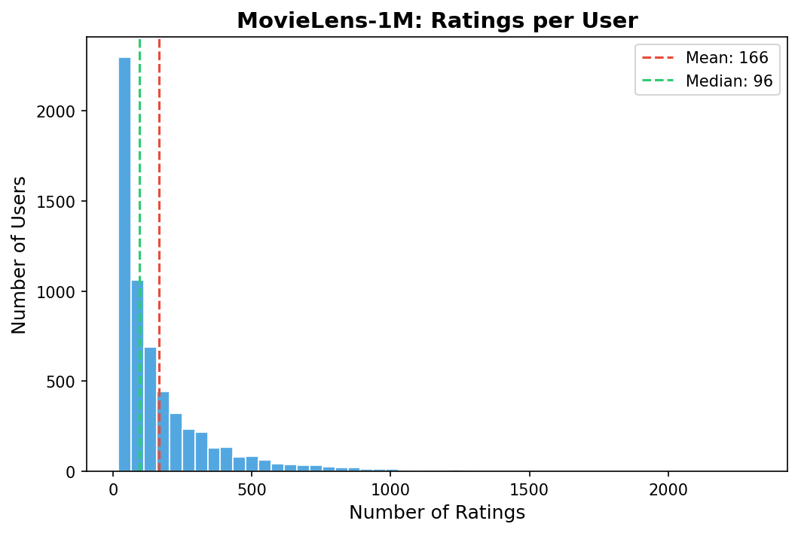

#### Ratings per Movie

| Metric | Value |
|---|---|
| Min | 1 |
| Max | 3,428 |
| Mean | 269.9 |
| Median | 123.5 |

Movies also follow a **long-tail distribution**. Popular movies like "American Beauty" and "Star Wars" receive thousands of ratings while niche films may have only 1.

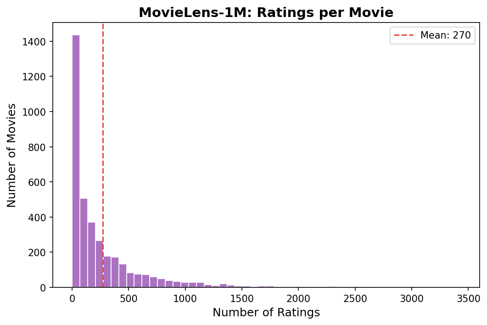

#### Genre Distribution

18 unique genres in the dataset:

| Genre | Movies | Genre | Movies |
|---|---|---|---|
| Drama | 1,603 | Crime | 211 |
| Comedy | 1,200 | War | 143 |
| Action | 503 | Documentary | 127 |
| Thriller | 492 | Musical | 114 |
| Romance | 471 | Mystery | 106 |
| Horror | 343 | Animation | 105 |
| Adventure | 283 | Fantasy | 68 |
| Sci-Fi | 276 | Western | 68 |
| Children's | 251 | Film-Noir | 44 |

**Drama** and **Comedy** dominate, together accounting for nearly half of all genre tags.

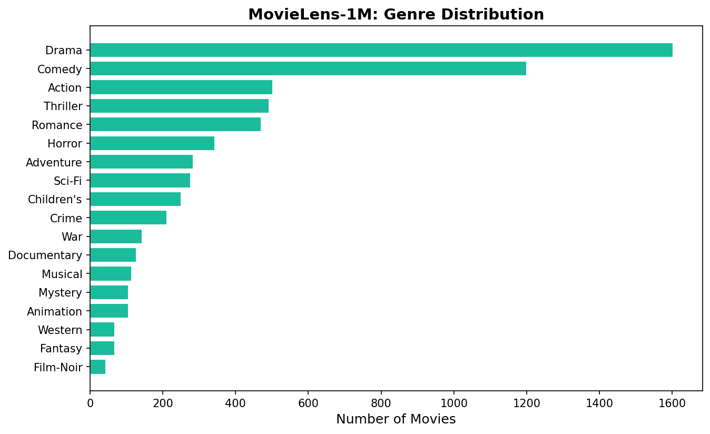

#### User Demographics

| Gender | Count | Percentage |
|---|---|---|
| Male | 4,331 | 71.7% |
| Female | 1,709 | 28.3% |

| Age Group | Count |
|---|---|
| Under 18 | 222 |
| 18–24 | 1,103 |
| 25–34 | 2,096 |
| 35–44 | 1,193 |
| 45–49 | 550 |
| 50–55 | 496 |
| 56+ | 380 |

The user base skews **male** (71.7%) and **young adult** (25–34 is the largest group).

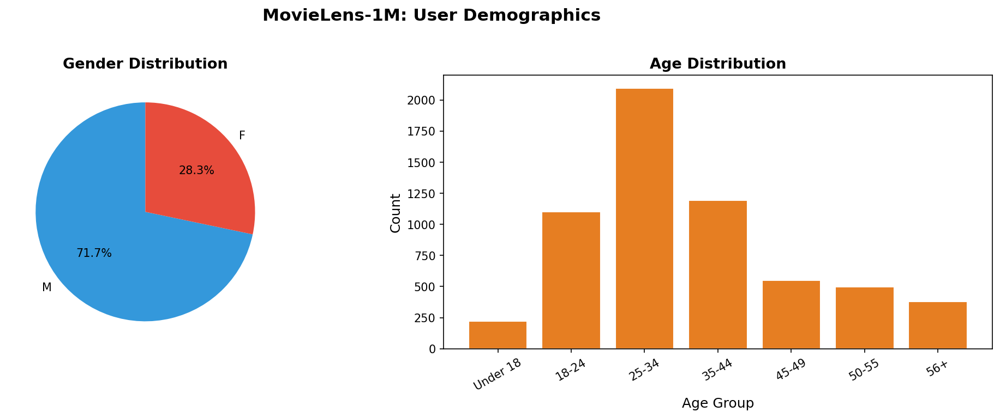

#### Temporal Analysis

Ratings span from **April 2000** to **February 2003**, with the vast majority collected in the year 2000:

| Year | Ratings |
|---|---|
| 2000 | 904,757 |
| 2001 | 68,058 |
| 2002 | 24,046 |
| 2003 | 3,348 |

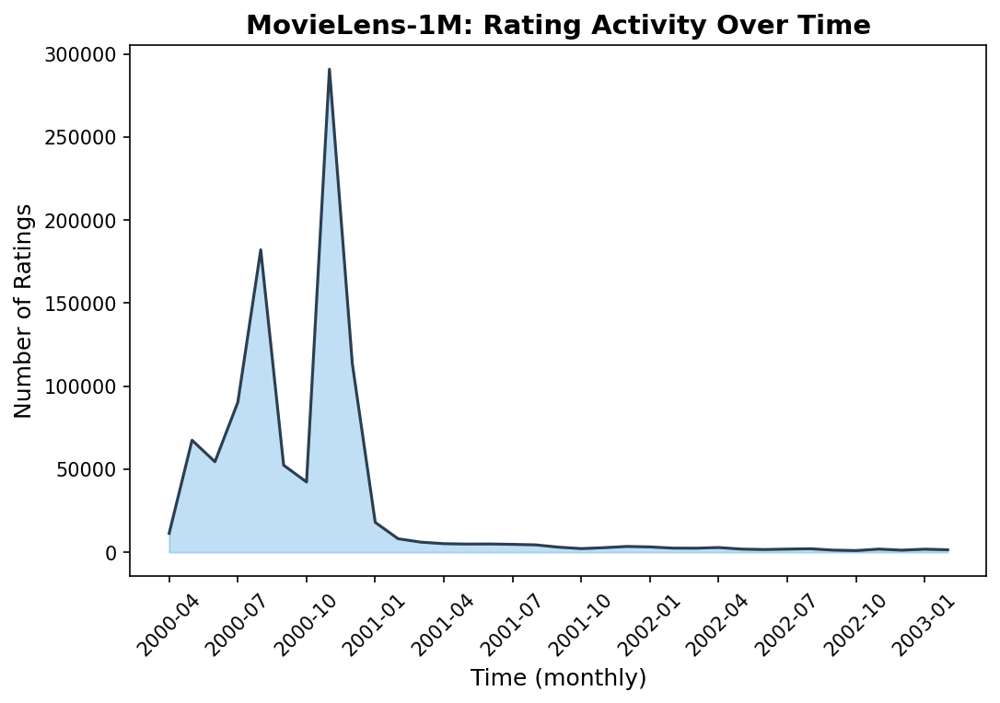

#### Implicit Feedback Split (RKGCN)

For RKGCN, ratings ≥ 4 are treated as **positive** and the rest as negative:

| Class | Count | Percentage |
|---|---|---|
| Positive (≥ 4) | 575,281 | 57.5% |
| Negative (< 4) | 424,928 | 42.5% |

A **57.5%/42.5% split** — reasonably balanced for binary classification.

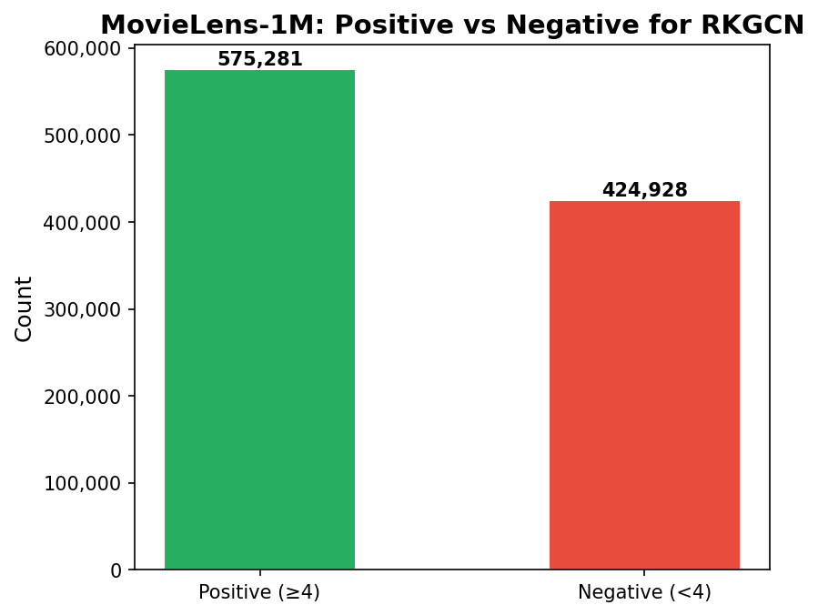

#### Training Results (RKGCN)

After training the model for 25 epochs using the paper defaults, the final evaluation on the test set yielded the following results:

- **Test AUC**: 0.9054
- **Test Accuracy**: 82.41%

Below are the learning curves generated during training:

**Training Loss**  
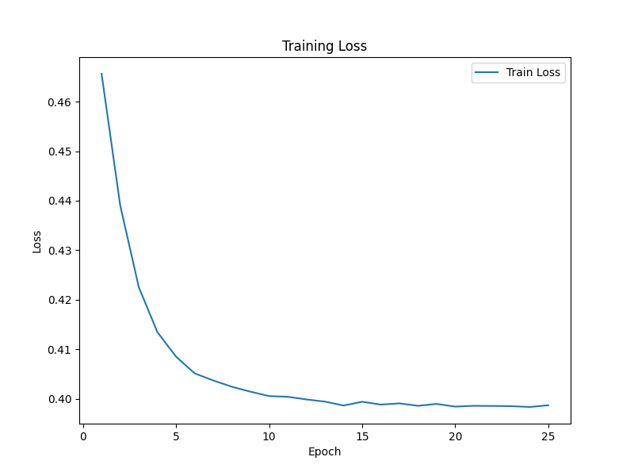

**AUC Curve (Train vs Val)**  
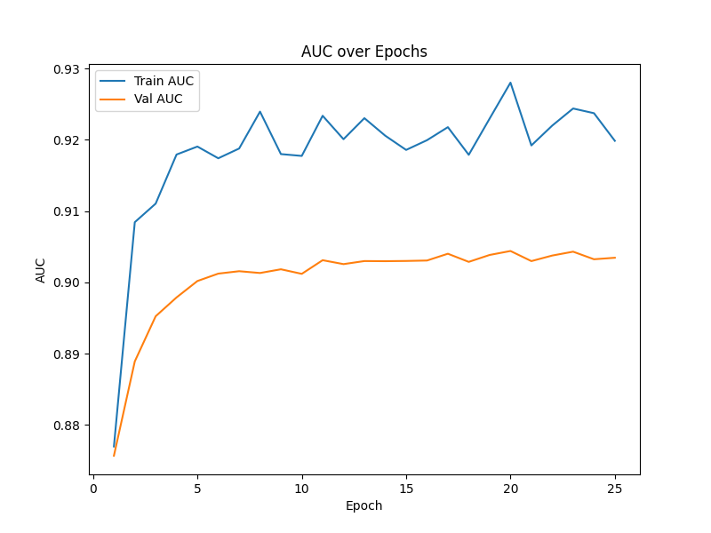

**Accuracy Curve (Train vs Val)**  
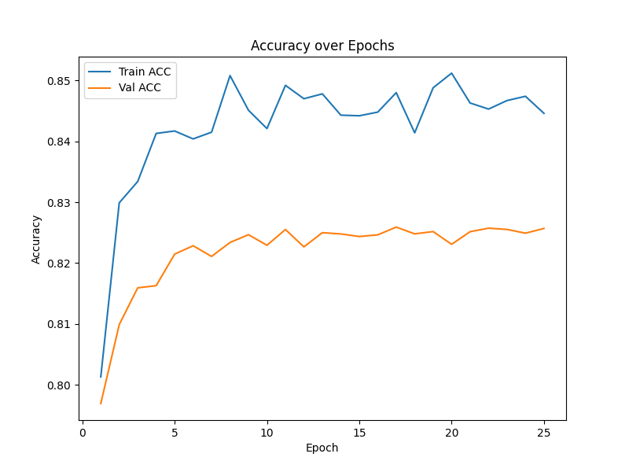

---

### Book-Crossing

#### Basic Statistics

| Metric | Value |
|---|---|
| Total ratings | 1,149,780 |
| Unique users (ratings) | 105,283 |
| Unique books (ratings) | 340,556 |
| Total books in DB | 271,379 |
| Total users in DB | 278,859 |
| Density | 0.003% |
| **Sparsity** | **99.997%** |
| Avg ratings/user | 10.9 |
| Avg ratings/book | 3.4 |

This is an **extremely sparse** dataset — users rate only ~11 books on average, and most books have just 1 rating.

#### Explicit vs Implicit Ratings

| Type | Count | Percentage |
|---|---|---|
| Explicit (rating > 0) | 433,671 | 37.7% |
| Implicit (rating = 0) | 716,109 | 62.3% |

A rating of 0 indicates the user interacted with the book (e.g., bought it) but did not provide an explicit rating.

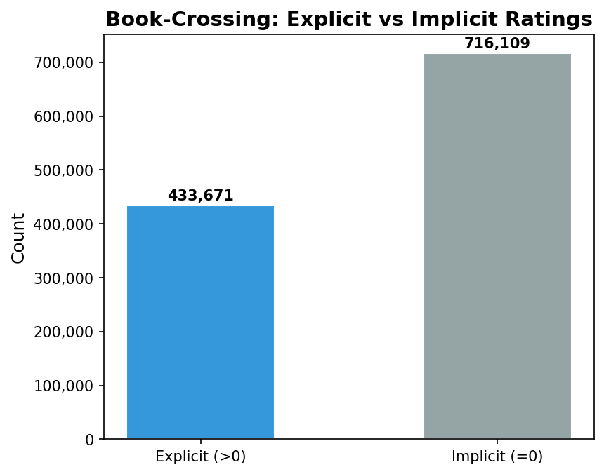

#### Explicit Rating Distribution (1–10)

| Rating | Count | Percentage |
|---|---|---|
| 1 | 1,770 | 0.4% |
| 2 | 2,759 | 0.6% |
| 3 | 5,996 | 1.4% |
| 4 | 8,904 | 2.1% |
| 5 | 50,974 | 11.8% |
| 6 | 36,924 | 8.5% |
| 7 | 76,457 | 17.6% |
| 8 | 103,736 | 23.9% |
| 9 | 67,541 | 15.6% |
| 10 | 78,610 | 18.1% |

Mean rating: **7.60**, Median: **8.0** — heavily **left-skewed**, users predominantly give high ratings (8 is the most common).

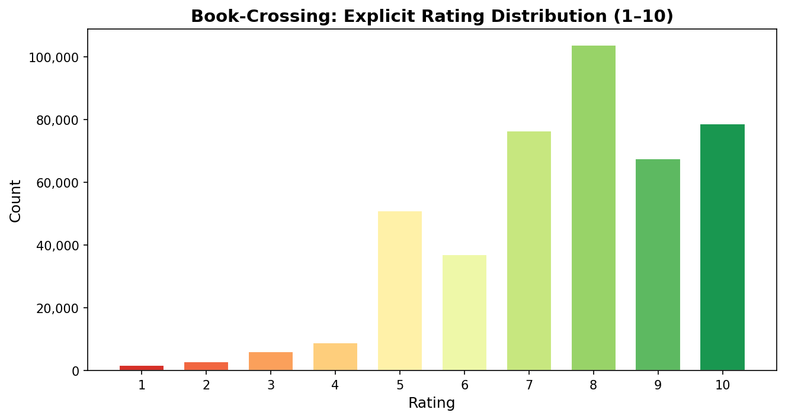

#### Ratings per User

| Metric | Value |
|---|---|
| Min | 1 |
| Max | 13,602 |
| Mean | 10.9 |
| Median | 1.0 |
| Users with ≥ 5 ratings | 22,816 |

**Median of 1** means over half of users have only a single interaction — extreme long-tail distribution. Only 22,816 users (21.7%) have ≥ 5 ratings.

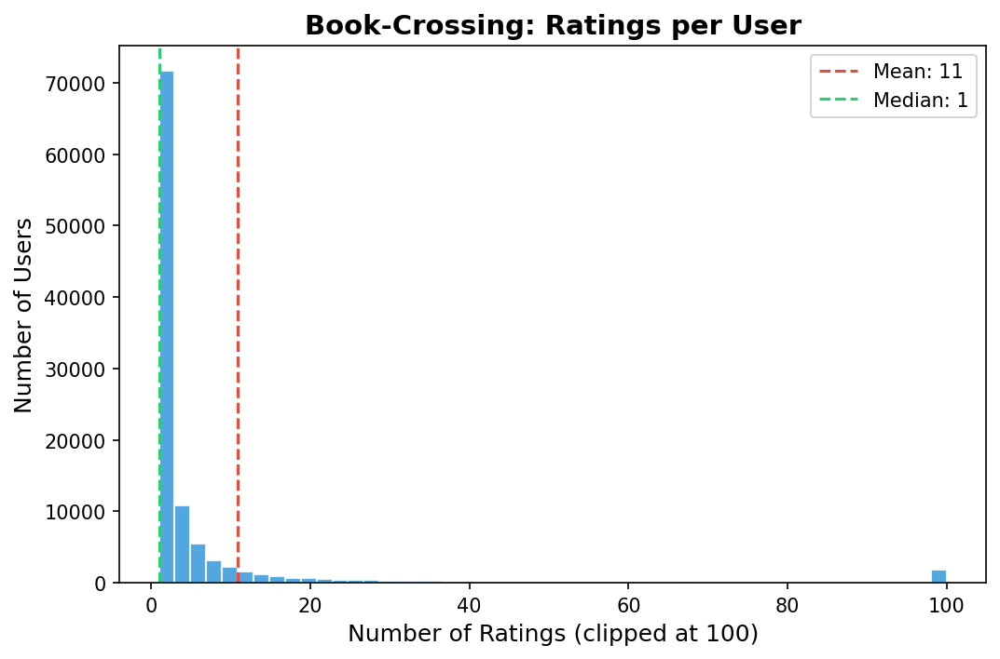

#### Ratings per Book

| Metric | Value |
|---|---|
| Min | 1 |
| Max | 2,502 |
| Mean | 3.4 |
| Median | 1.0 |
| Books with ≥ 5 ratings | 43,765 |

Similar long-tail pattern — most books have only 1 rating. Only 43,765 books (12.9%) have 5+ ratings.

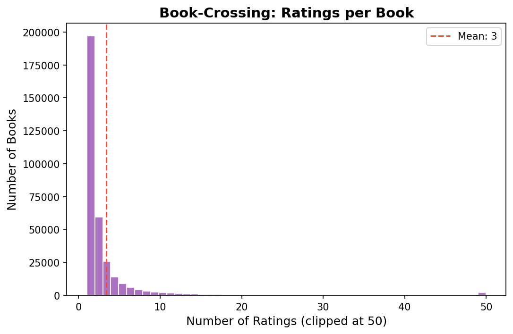

#### Top 15 Authors (by number of books)

| Author | Books | Author | Books |
|---|---|---|---|
| Agatha Christie | 632 | Charles Dickens | 302 |
| William Shakespeare | 567 | R. L. Stine | 282 |
| Stephen King | 524 | Mark Twain | 231 |
| Ann M. Martin | 423 | Jane Austen | 223 |
| Carolyn Keene | 373 | Terry Pratchett | 220 |
| Francine Pascal | 373 | | |
| Isaac Asimov | 330 | | |
| Nora Roberts | 315 | | |
| Barbara Cartland | 307 | | |

A mix of **classic literature** (Shakespeare, Dickens, Austen) and **prolific popular fiction** (King, Christie, Roberts).

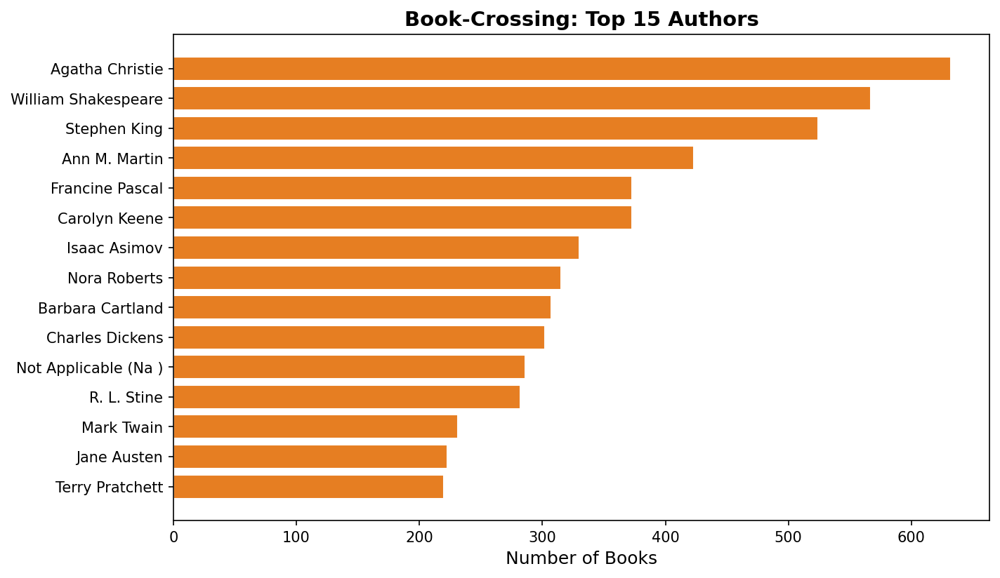

#### Top 15 Publishers

| Publisher | Books | Publisher | Books |
|---|---|---|---|
| Harlequin | 7,536 | Warner Books | 2,727 |
| Silhouette | 4,220 | Penguin USA | 2,717 |
| Pocket | 3,905 | Harpercollins | 2,526 |
| Ballantine Books | 3,783 | Fawcett Books | 2,258 |
| Bantam Books | 3,647 | Signet Book | 2,070 |
| Scholastic | 3,160 | Random House Inc | 2,045 |
| Simon & Schuster | 2,928 | | |
| Penguin Books | 2,844 | | |
| Berkley Publishing Group | 2,771 | | |

**Harlequin** leads by a wide margin (romance imprint), followed by mass-market paperback publishers.

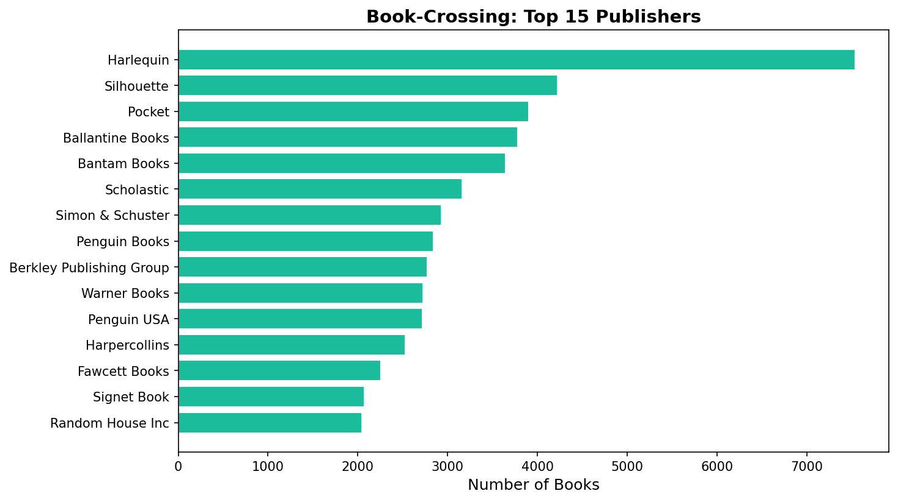

#### User Age Distribution

| Metric | Value |
|---|---|
| Users with valid age | 166,661 / 278,859 (59.8%) |
| Age range | 1 – 119 |
| Mean age | 34.8 |
| Median age | 32.0 |

The user base skews **young adult** (median 32), with a fairly normal distribution centered around the late 20s to early 30s.

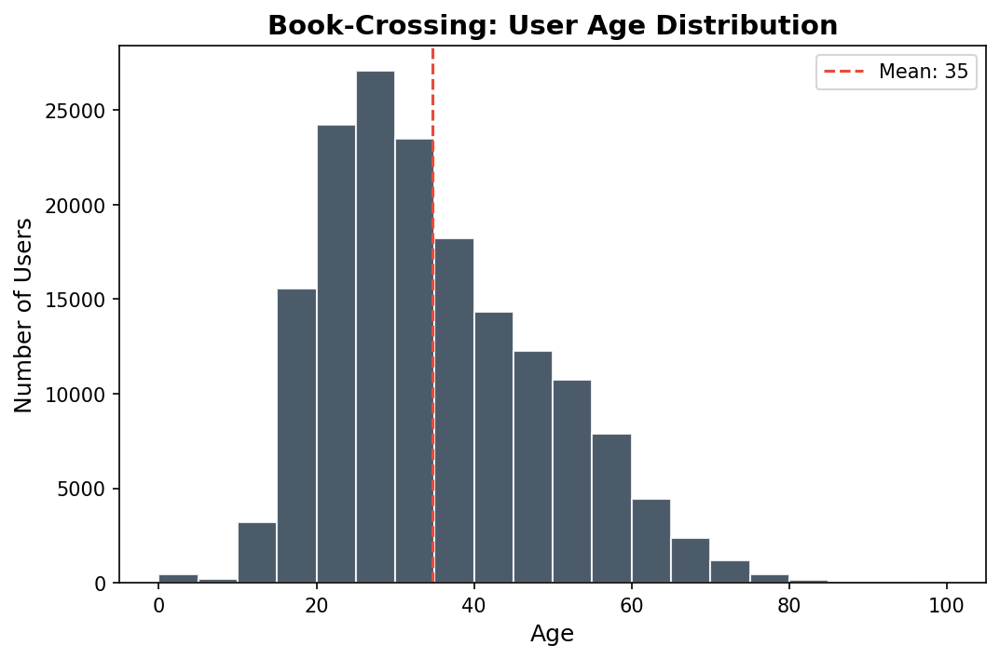

#### Publication Year

| Decade | Books |
|---|---|
| 1950s | 623 |
| 1960s | 1,773 |
| 1970s | 12,774 |
| 1980s | 52,780 |
| 1990s | 126,024 |
| 2000s | 72,471 |

The vast majority of books were published in the **1990s** (47% of books with valid years). This aligns with the dataset collection period (~2004).

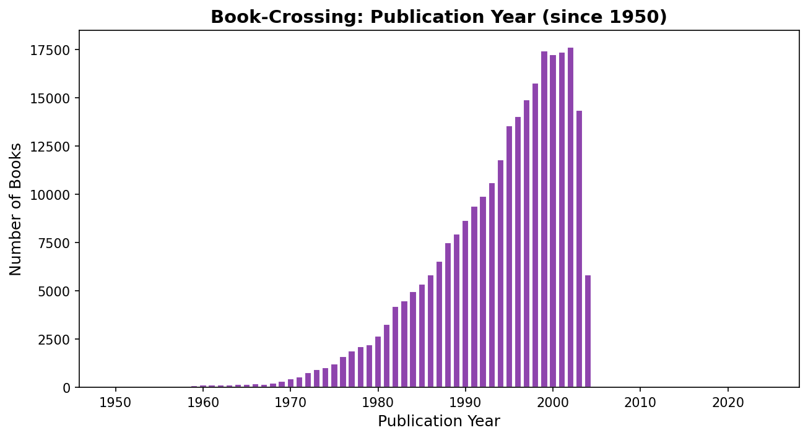

#### Implicit Feedback Split (RKGCN)

For RKGCN, any explicit rating > 0 is treated as **positive**:

| Class | Count | Percentage |
|---|---|---|
| Positive (> 0) | 433,671 | 37.7% |
| Implicit (= 0) | 716,109 | 62.3% |

A **37.7%/62.3% split** — imbalanced toward implicit/negative, which is typical for real-world recommendation datasets.

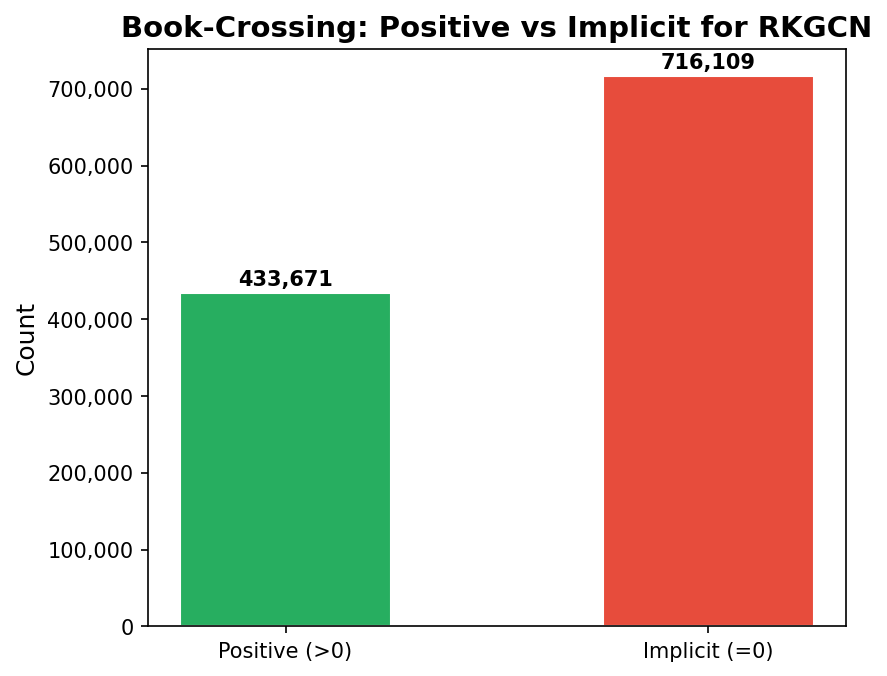

---

## Model Architecture

```
User ──► Ripple Set (H hops) ──► Attention + Aggregation ──► User Embedding (o_u)
                                                                    │
Item ──► KG Neighbors ──► GCN (user-aware weights) ──► Enhanced Item Embedding (e_v')
                                                                    │
                                                    Prediction: σ(o_u · e_v')
```

**Loss Function**: L = L_rec (cross-entropy) + λ₁ · L_KGE + λ₂ · L_reg

---

## References

1. Chen Li et al., "Ripple Knowledge Graph Convolutional Networks for Recommendation Systems", *Machine Intelligence Research*, 2024.
2. Wang et al., "RippleNet: Propagating User Preferences on the Knowledge Graph for Recommender Systems", *CIKM*, 2018.
3. Wang et al., "Knowledge Graph Convolutional Networks for Recommender Systems", *WWW*, 2019.
